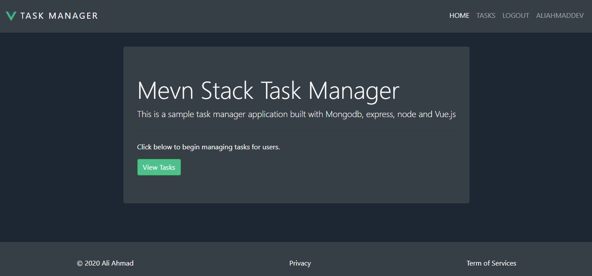

# Task Manager



## Project setup

### Requirements

1. MongoDB server must be up at `localhost:27017`
2. Nodemon to be installed globally. Use `npm install nodemon -g`

### Install Dependencies

```
npm install
```

### Compiles and hot-reloads for development

```
npm run dev
```

Now, the App is avaiable at `http://localhost:8080/`

And server is running at `http://localhost:3000/`

### Compiles and minifies for production

```
npm run build
```

### Lints and fixes files

```
npm run lint
```

### Vue Customize configuration

See [Configuration Reference](https://cli.vuejs.org/config/).
